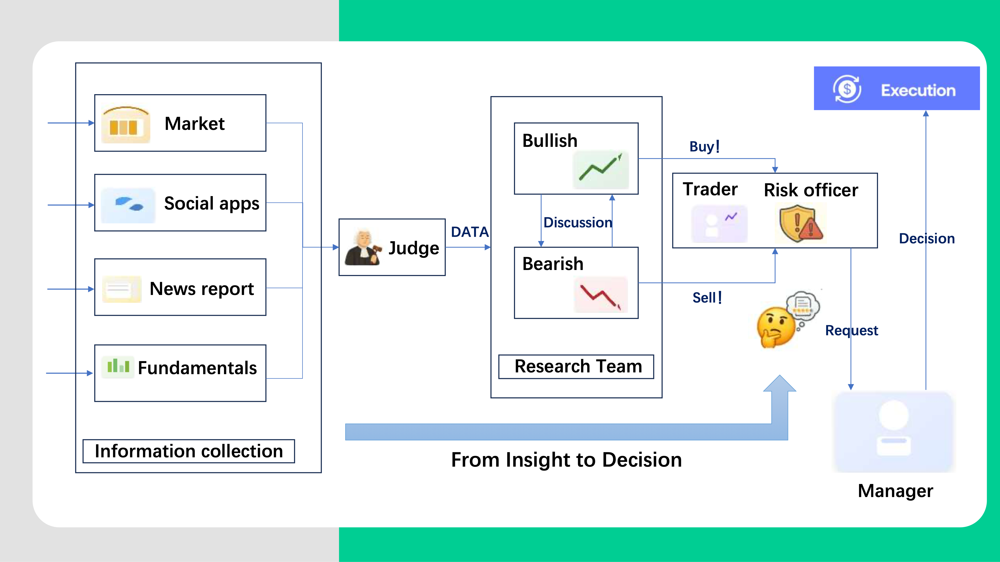

# TradeSwarm - 多智能体量化交易系统

## 项目概述

TradeSwarm是一个基于多智能体协作的量化交易系统，采用多线程并行Pipeline架构设计。系统通过专业化的信息处理Agent和研究分析Agent协同工作，最终由交易决策Agent生成交易指令。整个交易决策流程由多条并行Pipeline组成，每条Pipeline内部实际上就是一个完整的Agent工作流(workflow)，通过多个Agent之间的协作完成特定的信息处理或决策任务。

## 核心特性

- **多线程并行Pipeline架构**：四条信息处理Pipeline并行运行，高效处理市场数据、社交媒体、新闻报道和基本面信息
- **专业化Agent分工**：每个Agent专注特定领域，通过协作形成完整的交易决策链
- **迭代优化机制**：Research Team通过多轮迭代分析Bullish/Bearish信号，不断优化投资建议
- **风险管理集成**：交易决策过程内置Risk Officer进行风险评估，确保交易安全性
- **异步执行框架**：基于asyncio实现真正的并发执行，支持大规模Agent并行调度

## 系统架构

### Pipeline设计

系统采用分层Pipeline架构，信息从底层采集到顶层决策逐级流转：



### Agent职责分工

#### Layer 1: 信息采集Agent

**四个并行Pipeline独立运行，各自处理特定类型的市场信息**

1. **Market Agent** (Pipeline 1)
   - 处理实时市场数据、价格走势、成交量等技术指标
   - 输出：技术分析报告

2. **Social Apps Agent** (Pipeline 2)
   - 监控社交媒体舆情、投资者情绪、热点话题
   - 输出：情绪分析报告

3. **News Report Agent** (Pipeline 3)
   - 分析财经新闻、行业动态、政策变化
   - 输出：新闻摘要与影响评估

4. **Fundamentals Agent** (Pipeline 4)
   - 评估公司基本面、财务数据、行业地位
   - 输出：基本面分析报告

#### Layer 2: 研究分析Agent

**Research Team (Pipeline 5) - 迭代优化机制**

5. **Bullish Analyst Agent**
   - 综合Layer 1的四份报告，识别看涨信号
   - 分析上涨潜力、支撑位、催化剂因素
   - 输出：看涨论证报告

6. **Bearish Analyst Agent**
   - 综合Layer 1的四份报告，识别看跌信号
   - 分析下跌风险、阻力位、负面因素
   - 输出：看跌论证报告

**迭代流程**：两个分析Agent相互审视对方报告，通过多轮循环优化分析结论，直到达到收敛条件或最大迭代次数。

#### Layer 3: 交易决策Agent

**Trading Team (Pipeline 6) - 决策生成机制**

7. **Trader Agent**
   - 基于Research Team的分析结果制定交易策略
   - 生成具体交易指令（买入/卖出/持有、数量、价格）
   - 输出：交易指令草案

8. **Risk Officer Agent**
   - 评估交易指令的风险敞口、资金管理、止损止盈
   - 识别潜在风险点并提出调整建议
   - 输出：风险评估报告

9. **Manager Agent**
   - 整合Trader和Risk Officer的意见
   - 做出最终交易决定并执行
   - 输出：最终交易决策

### 核心组件

```
TradeSwarm/
├── core/                          # 核心框架
│   ├── agent/                     # Agent基础组件
│   │   ├── base_agent.py          # BaseAgent基类（三阶段执行框架）
│   │   ├── config_validator.py    # 配置验证器
│   │   └── prompt_manager.py      # Prompt模板管理器
│   │
│   ├── agent_pool/                # Agent池管理
│   │   ├── agent_pool.py          # AgentPool（并发调度+限流）
│   │   └── types.py               # 数据结构定义
│   │
│   ├── pipelines/                 # Pipeline工作流（待实现）
│   │   ├── layer1_market.py       # Market数据处理Pipeline
│   │   ├── layer1_social.py       # Social媒体分析Pipeline
│   │   ├── layer1_news.py         # News报道分析Pipeline
│   │   ├── layer1_fundamentals.py # Fundamentals分析Pipeline
│   │   ├── layer2_research.py     # Research迭代分析Pipeline
│   │   └── layer3_trading.py      # Trading决策生成Pipeline
│   │
│   └── __init__.py                # 核心模块导出
│
├── tools/                         # 工具系统
│   ├── builtin_tools.py           # CAMEL内置工具封装
│   ├── registry.py                # 工具注册表（单例模式）
│   └── __init__.py
│
├── utils/                         # 工具函数
│   ├── config.py                  # 环境配置管理
│   └── __init__.py
│
├── configs/                       # Agent配置文件（待实现）
│   └── trading_agents/            # 交易Agent配置
│       ├── layer1_market.json          # Market Agent配置
│       ├── layer1_social.json          # Social Apps Agent配置
│       ├── layer1_news.json            # News Report Agent配置
│       ├── layer1_fundamentals.json    # Fundamentals Agent配置
│       ├── layer2_bullish.json         # Bullish Analyst配置
│       ├── layer2_bearish.json         # Bearish Analyst配置
│       ├── layer3_trader.json          # Trader Agent配置
│       ├── layer3_risk.json            # Risk Officer配置
│       └── layer3_manager.json         # Manager Agent配置
│
├── main.py                        # 主程序入口
├── README.md                      # 项目文档
└── .env                           # 环境变量配置
```

### 设计原则

- **专业化分工**：每个Agent专注特定领域，避免职责混淆
- **并行处理**：Layer 1的四个Agent完全并行运行，最大化信息处理效率
- **迭代优化**：Research Team通过多轮讨论优化分析质量
- **风险优先**：Trading Team将风险管理嵌入决策流程
- **可观测性**：完整记录Agent交互日志，支持决策过程追溯
- **容错机制**：单个Agent失败不影响整体系统运行（优雅降级）

## 技术实现

### BaseAgent三阶段执行框架

每个Agent内部采用统一的三阶段执行流程：

1. **Observing阶段**：观察与理解输入信息，可能调用工具获取上下文
2. **Planning阶段**：基于observation进行Chain-of-Thought推理，制定执行计划
3. **Acting阶段**：根据plan执行具体操作，调用工具并整合结果

### 并发执行与限流

**AgentPool并发管理**：
- 基于asyncio实现异步并发执行
- 双层限流控制：
  - Semaphore控制最大并发槽位数
  - RateLimiter（令牌桶算法）控制API调用速率
- 支持异构Agent注册和批量执行

**执行模式**：
- 同步执行：`agent.run()` - 适用于单Agent调试
- 异步执行：`agent.async_run()` - 适用于并行场景
- 批量执行：`agent_pool.execute_all()` - 适用于大规模Agent调度

### 工具系统

采用插件化工具架构：
- **ToolRegistry**：全局工具注册表（单例模式）
- **内置工具**：基于CAMEL框架的SearchToolkit、FileWriteToolkit
- **配置驱动**：通过JSON配置文件启用/禁用工具

## 技术栈

### 核心技术

| 类别 | 工具/库 | 说明 |
|------|---------|------|
| **语言** | Python 3.12 | 主要开发语言 |
| **Agent框架** | CAMEL | 多Agent协作框架 |
| **LLM接口** | 阿里百联API | 兼容OpenAI格式，通过环境变量配置 |
| **并发机制** | asyncio | Python标准异步执行框架 |
| **日志系统** | logging | Python标准日志库 |
| **依赖管理** | uv | 快速Python包管理器 |

### 环境配置

#### 虚拟环境设置

使用 `uv` 工具创建和管理 Python 虚拟环境：

```bash
# 进入项目目录
cd TradeSwarm

# 使用 Python 3.12 创建新的虚拟环境
uv venv --python 3.12

# 激活虚拟环境
source .venv/bin/activate

# 同步现有安装包
uv sync

# 安装rust，不然安装camel时候会报错
# macOS
brew install rust

# Linux
sudo apt update
sudo apt install rustc cargo

# 安装 camel-ai 及其所有依赖，如果时间不够还可以增加时间
UV_HTTP_TIMEOUT=900 uv pip install 'camel-ai[all]'
```

#### 环境变量配置

项目使用`.env`文件管理环境变量，主要配置项：

```bash
# 阿里百联API配置
ALIBABA_API_KEY=your_api_key_here
ALIBABA_API_BASE=https://dashscope.aliyuncs.com/compatible-mode/v1
ALIBABA_MODEL_NAME=qwen-max

# 可选：多模型配置
ALIBABA_MODEL_CHEAP=qwen-turbo      # 简单任务使用
ALIBABA_MODEL_POWERFUL=qwen-max     # 复杂任务使用
```

详细配置模板参见`.env.example`文件。

## 快速开始

### 运行示例

```bash
# 运行Agent池并行执行演示
python main.py
```

## 开发路线图

- [x] 核心框架实现（BaseAgent + AgentPool）
- [x] 工具系统与配置管理
- [ ] Layer 1: 四个信息采集Agent配置
- [ ] Layer 2: Research Team迭代机制
- [ ] Layer 3: Trading Team决策流程
- [ ] 数据接口集成（市场数据、新闻源等）
- [ ] 回测系统
- [ ] 性能监控与日志分析
- [ ] 风险控制优化

## 研究规范

本项目遵循研究型代码开发规范：

- **MVP开发准则**：不使用默认值和测试代码，避免逻辑错误被掩盖
- **类型注解规范**：所有方法签名包含完整类型注解
- **文档规范**：所有模块、类、方法包含中文docstring
- **代码组织**：使用阶段化注释组织复杂逻辑
- **命名规范**：遵循Python PEP 8标准

## 许可证

本项目采用MIT许可证开源。

## 参考资料

- [TradingAgents](https://github.com/TauricResearch/TradingAgents) - 多智能体量化交易系统的相关参考实现

## 联系方式

如有问题或建议，欢迎通过GitHub Issues联系。
